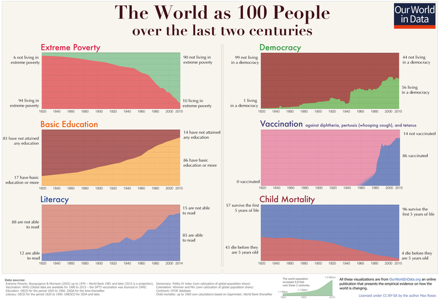

[Now is the best time in human history to be alive](https://www.youtube.com/watch?v=nK7AbxTGDSU) est un discours d'Obama
qui résume assez bien les choses. Peu importe qui vous êtes (âge, sexe, genre, couleur de peau, famille...), il n'y a
pas de meilleur moment dans l'histoire pour vivre qu'aujourd'hui.

Un simple graphique pour résumer les choses:

Cependant, il est difficile de faire accepter que le capitalisme améliore le sort de la société dans son ensemble à ceux
qui sont potentiellement menacés par les effets de la concurrence et des phases récessives de l’économie.

Conscients de leurs acquis et de leur situation favorable, les citoyens vont rechercher un système plus stable,
d’apparence plus protecteur et dans le même temps, se montrer de plus en plus à l’écoute des critiques contre le
capitalisme.

Cette tendance sera d’autant plus forte que le capitalisme encourage la liberté de pensée, ce qui va favoriser
l’émergence de groupe d’individus dont la fonction est justement de conduire le réquisitoire anticapitaliste. Ces
individus, que Schumpeter nomme "intellectuels" ou "professionnels de l’agitation sociale", ne sont pas intégrés dans la
sphère économique. Ils peuvent donc la critiquer à loisir. Leur rôle est de stimuler, activer, exprimer et organiser les
sujets de mécontentement (cf. Mélenchon).
