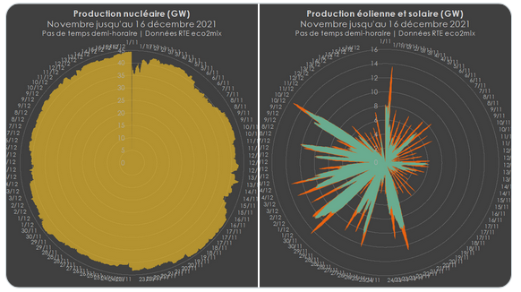

Le gros problème de l'éolien et du solaire et qu'ils ne sont pas pilotables ce qui fait qu'un soit d'hiver où il n'y a
pas de vent, vous vous retrouvez sans rien... et vous devez donc démarrer une source d'électricité pilotable : Nucléaire
en france, Charbon & gaz en Allemagne.

La question de remplacer les sources nucléaires ou fossiles par l'éolien et du nucléaire n'a donc aucun sens, au moins
tant qu'on ne sera pas stocké efficacement de l'électricité dans des quantités énormes.

Cela peut se voir par exemple quand on regarde [les capacités installées et productions réelles du nucléaire, du solaire
et de l'éolien en Allemagne de 2015 à 2021](allemagne_solaire_nucleaire_eolien.mp4).

Voici un graphique pour comparer les notions d'intermittence entre nucléaire et solaire :

C'est pour cela que l'Allemagne a complètement échoué.

Et en france, malgré 10,5% de puissance éolienne installée en plus en 2022, leur production électrique totale n'a
augmenté que de
2,7%. [Le facteur de charge reste très faible à 21,6%](https://analysesetdonnees.rte-france.com/bilan-electrique-synthese).

L'Allemagne
pourrait [réactiver 15 de ses centrales mises en veille dans le cadre de sa politique environnementale](https://twitter.com/bfmbusiness/status/1529406893235613697)
or, pour rappel, une seule centrale à charbon en Allemagne émet plus de CO2 que tout l’aérien français, intérieur et
international réunis. L’Allemagne compte DÉJÀ plus de 80 centrales à charbon....

En 2011, l’Allemagne décide d’arrêter le nucléaire en 10 ans, et lance la transition énergétique. Au 1er semestre 2021,
[“la 1ère source d’électricité en Allemagne est le charbon”](https://www.dw.com/en/germany-coal-tops-wind-as-primary-electricity-source/a-59168105)
...

Et pourtant, on peut se passer du charbon, l'utilisation du charbon pour l'électricité au Royaume-Uni s'est effondrée de
93 % depuis 2015 et ne représente plus que 2 % de la production d'électricité...

