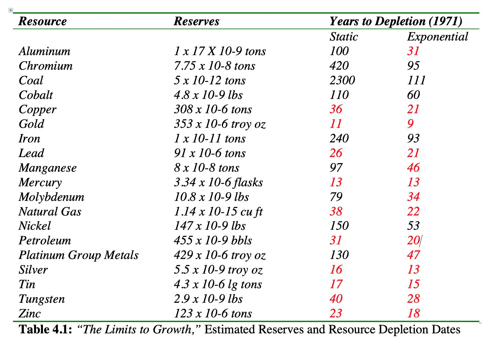

La pénurie de bois de chauffage était angoissante en 1750 en Angleterre. Malthus expliquait qu’au-dessus de 7 millions
d’habitants les Anglais mourraient de fin, on craignait une pénurie d’argent à cause de la photo argentique, il n'y
aurait pas assez de cuivre dans le monde pour que chaque Américain ait le téléphone...

D'ailleurs, beaucoup citent le fameux livre "limits to growth" qui aurait déjà tout expliqué il y a 50 ans... hors 50
ans après, voici les prédictions extraites du livre (aucune ne s'est bien sûr réalisée) :

On peut aussi citer Paul R. Ehrlich et son fameux livre "La bombe P" qui expliquait il y a aussi 50 ans que :
"The battle to feed all of humanity is over. In the 1970s hundreds of millions of people will starve to death in spite
of any crash programs embarked upon now. At this late date nothing can prevent a substantial increase in the world death
rate"

Les prévisions d'effondrement dues à la croissance démographique, à la surconsommation, à l'épuisement des ressources et
à la pollution, remontant au révérend Thomas Malthus au XVIIIe siècle, ne se sont jamais réalisées.

La vraie question pour la croissance future n'est pas celle de l'épuisement des ressources utilisées aujourd'hui; c'est
la faillite de l'imagination de sociétés tellement nombrilistes qu'elles n'imaginent pas que l'avenir puisse être
autrement que le présent.

["Des scientifiques qui s'appuient sur les dernières recherches et utilisent des computers perfectionnés prévoient des
difficultés sinon la fin du monde pour l'an 2000" affirmaient les médias en 1972](https://twitter.com/JL7508/status/1314967415214792704)
